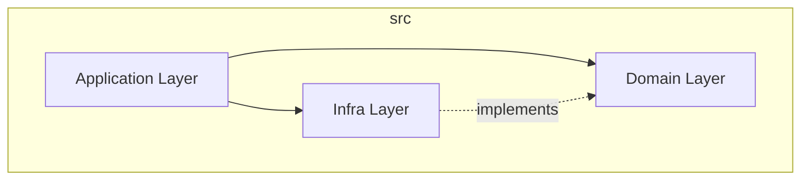

# Architecture Documentation - Quantix

Quantix is a personal finance management API capable of handling complex financial scenarios including credit card statements, installments, and recurrences.

## 🏗 High-Level Architecture

Quantix follows a **Domain-Centric (Hexagonal-inspired) Architecture** layered over the NestJS framework. This ensures that business logic remains independent of the database and external frameworks.

### Layering Strategy

1.  **Domain Layer** (`src/domain/`)
    *   **Responsibility:** Contains purely business logic, rules, and invariants.
    *   **Components:** Entities, Value Objects, contracts (Repository Interfaces).
    *   **Dependencies:** ZERO dependencies on frameworks (NestJS, TypeORM) or infrastructure code.

2.  **Infrastructure Layer** (`src/infra/`)
    *   **Responsibility:** Implements the technical details required to support the domain.
    *   **Components:** Database adapters (TypeORM entities, Repo implementations), HTTP filters, external API clients.
    *   **Dependencies:** Depends on the Domain layer (to implement interfaces) and external libraries.

3.  **Application/Module Layer** (`src/modules/`)
    *   **Responsibility:** Orchestrates user interactions and wires the application together.
    *   **Components:** NestJS Modules, Controllers, Services (Application Services).
    *   **Dependencies:** Connects Domain and Infra layers via Dependency Injection.

## 📂 Project Structure

-   `src/domain/`
    -   `entities/` - Pure TS classes representing domain concepts (e.g., `Transaction`).
    -   `repositories/` - Interfaces defining data access contracts (e.g., `TransactionRepository`).
-   `src/infra/`
    -   `database/entities/` - TypeORM entities annotated with DB metadata.
    -   `database/repositories/` - Implementations of domain repositories.
-   `src/modules/` - Feature-based folders containing Controllers and Services.

## 📦 Core Domain Modules & Concepts

### 1. Transactions (`src/modules/transactions`)
The heart of the system. Tracks incomes and expenses.
-   **Installments:** Handled at creation time. A purchase of $300 in 3 installments creates 3 distinct transaction records, each linked by an `installmentGroupId`.
-   **Recurrence:** Handled via `RecurrenceRule`.
-   **Payment Methods:** Cash, Pix, Debit, Credit.

### 2. Credit Cards & Statements (`src/modules/credit-cards`)
-   **Virtual Statements:** There is no physical "Statement" table.
-   **Logic:** A statement is calculated dynamically by aggregating transactions based on the card's `closingDay` and `dueDay`.
-   **Period Calculation:** Given a `closingDay` of 15, a statement due on Feb 22nd covers transactions from Jan 16th to Feb 15th.

### 3. Summary (`src/modules/summary`)
Provides the monthly financial overview.
-   **Aggregation Rule:** Credit card expenses are NOT shown individually in the monthly summary. Instead, they are rolled up into a single "Credit Card Statement" item due in that month.

## 💾 Data Model (SQLite)

Although the domain is decoupled, the underlying schema uses SQLite.

| Table | Description | Key Fields |
| :--- | :--- | :--- |
| `categories` | Transaction categories | `id`, `name`, `type` (INCOME/EXPENSE) |
| `credit_cards` | Credit card configurations | `id`, `name`, `brand`, `limitAmount`, `closingDay`, `dueDay` |
| `transactions` | Ledger of all financial movements | `id`, `type`, `name`, `amount`, `date`, `paymentMethod`, `creditCardId`, `categoryId`, `accountId`, `installmentGroupId`, `installmentNumber`, `installmentTotal`, `recurrenceRuleId`, `paid` |
| `recurrence_rules` | Rules for repeating transactions | `id`, `transactionId`, `frequency`, `interval`, `startDate`, `endDate`, `active` |
| `accounts` | Financial accounts (bank, wallet, etc.) | `id`, `name`, `type`, `initialBalance`, `currentBalance`, `createdAt`, `updatedAt` |

## 🔄 Key Data Flows

### A. Creating a Transaction with Installments
1.  **Request:** `POST /transactions` with `installments: 3` and `amount: 3000`.
2.  **Service:**
    *   Validates method is `CREDIT` and `creditCardId` exists.
    *   Calculates split amount ($1000).
    *   Generates 3 `Transaction` entities.
    *   Adjusts dates for subsequent months.
3.  **Repository:** Persists all 3 records transactionally.

### B. Fetching Monthly Summary
1.  **Request:** `GET /summary?month=2026-03`.
2.  **Service:**
    *   Fetches all non-credit Transactions for Mar 2026.
    *   Fetches all Credit Cards.
    *   For each card, calculates the statement period ending in Mar 2026.
    *   Aggregates credit transactions falling into those periods.
3.  **Response:** Returns `income`, `expenses` (sum of non-credit + card statements), and `balance`.

## 🔐 Authentication & Authorization

*   **API Key Authentication:** All endpoints require an `API-KEY` header for authentication.
*   **Header Validation:** Requests are validated against stored API keys in the system.

## 🚀 Deployment & Scalability

*   **Database:** SQLite is used for simplicity and portability, suitable for single-server deployments.
*   **Environment Configuration:** Database connection and other settings are configurable via environment variables.
*   **Horizontal Scaling:** For scaling, consider migrating to PostgreSQL or MySQL and implementing load balancing.

## 🛠 Design Decisions

-   **Dual Entities:** We explicitly map between `Transaction` (Domain) and `TransactionEntity` (TypeORM). This prevents leaky abstractions where DB annotations pollute business logic.
-   **String-based DI:** Repositories are injected using tokens (e.g., `@Inject('TransactionRepository')`) to allow easy swapping of implementations (e.g., for testing).
-   **Date Handling:** All date manipulations strictly use `DateUtil` wrapper to ensure consistency (Timezones, formatting).
-   **Index Optimization:** Database indexes are carefully defined to optimize query performance on commonly accessed fields like `date`, `categoryId`, `creditCardId`, etc.
